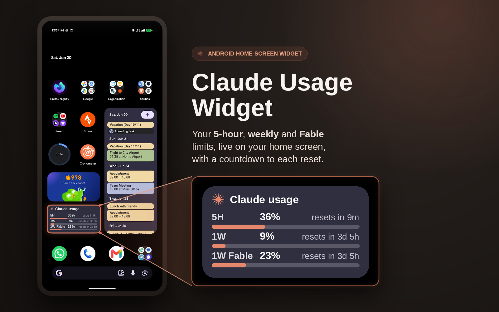
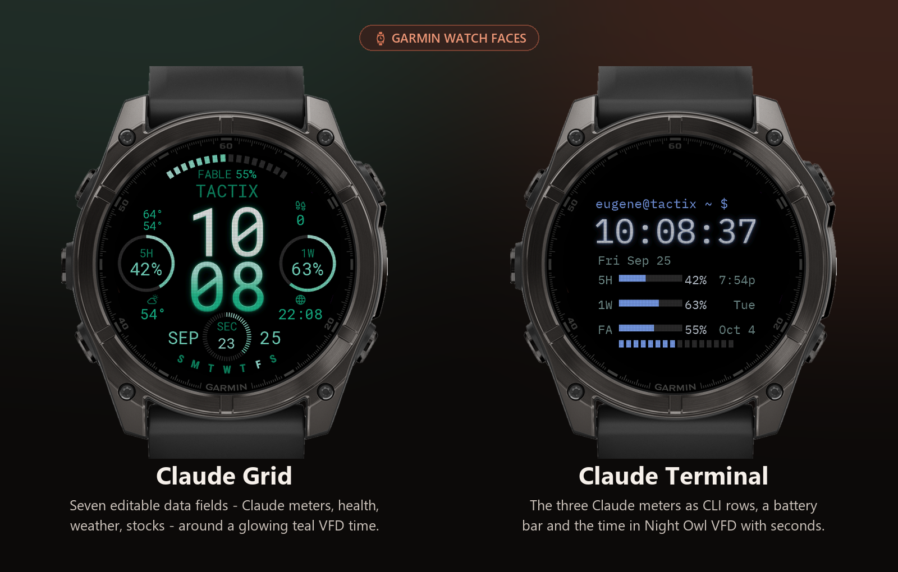

<div align="center">

# ✳️ Claude Usage Widget

**An Android home-screen widget for your Claude subscription usage — plus a Garmin watch app and two watch faces.**
Keeps your `5H`, `1W` and `1W Fable` percentages (plus *“resets in”* countdowns) live on your home screen and on your wrist.


<br />



<br />

### [](https://github.com/eugene8080/claude-usage-widget/releases/latest/download/claude-usage-widget.apk)

Sign in once on the phone; the widget refreshes itself in the background.

<sub>The button serves the latest tagged release. Every push is also built by CI —
grab `app-debug.apk` from the newest run under
**[Actions](https://github.com/eugene8080/claude-usage-widget/actions)** to install a
change that hasn't been tagged yet.</sub>

</div>

---

## 📲 Install in 3 steps

1. **[Download the APK](https://github.com/eugene8080/claude-usage-widget/releases/latest/download/claude-usage-widget.apk)** on your Android phone (tap the button above).
2. **Open the downloaded file** and tap **Install**.
3. The first time, Android asks to **allow installs from this source** (your browser or file app). Tap **Settings → enable “Allow from this source” → back → Install**. If Play Protect shows an *“unsafe app?”* prompt, that warning appears for any app not installed from the Play Store; choose **Install anyway**.

> Why the warnings? The APK is sideloaded rather than shipped through the Play Store, so Android plays it safe. It's the normal two-tap detour for any direct APK.

> **Replacing an existing install?** Android refuses to install over an APK signed with a
> different key. With the signing secrets below configured every build is signed with the
> same key and updates install straight over one another; without them AGP generates a
> per-machine debug key, and since a CI runner is a new machine every run, each build gets
> a different one and every update needs an uninstall first. Uninstalling clears the stored
> session, so you sign in to Claude again afterwards.

Then continue with first-run setup below.

## 👋 First-run setup

1. Open the **Claude Usage** app and tap **Sign in**, then complete the normal `claude.ai` login in the WebView. It closes automatically once it captures your session.
2. Tap **Test fetch now** to confirm it prints your current `5H`, `1W` and `1W Fable` percentages. These should match `claude.ai/settings/usage`.
3. **Let it run in the background — required.** The app opens a *Keep Claude Usage running* prompt (also under **Background settings**); follow both parts. See [Required phone settings](#-required-phone-settings) below.
4. Long-press your home screen → **Widgets** → **Claude Usage**, drag it on, and resize it however you like. Tap it any time to refresh.

## 🔋 Required phone settings

The widget refreshes every 15 minutes and pushes to your Garmin watch **in the background**. Two separate layers of your phone can stop that, and both must allow it:

1. **Android battery optimization → off for Claude Usage.** The prompt's **Allow** button asks for this directly (or *Settings → Apps → Claude Usage → Battery → Unrestricted*).
2. **Your manufacturer's own battery manager → allow background activity**, for **Claude Usage and Garmin Connect** (Garmin Connect carries the Bluetooth messages to the watch). Apps can't read or change this switch, so the prompt opens each app's *App info* page for you:
   - **Oppo / OnePlus / realme (ColorOS):** *App info → Battery usage →* **Allow background activity**. Without it, ColorOS freezes the app about 5 seconds after each background wake — the widget still updates, but the watch send is cut off every time.
   - **Samsung (One UI):** *App info → Battery →* **Unrestricted**, and make sure neither app is in *Sleeping apps* / *Deep sleeping apps*.
   - **Xiaomi / Redmi / POCO (HyperOS/MIUI):** *App info →* **Autostart** on, *Battery saver →* **No restrictions**.

If a watch send is still stopped by the phone later, the prompt comes back and the app's **watch:** line reads *"stopped by the phone before it finished"*.

## 📋 Requirements

- A Claude **Pro/Max** subscription (this reads consumer subscription usage, not API-key usage).
- **Android 8.0 (API 26)** or newer. Built and tested on a Pixel 9 / Android 16 and an Oppo Find N5 (ColorOS).
- **Background activity allowed** for the app — see [Required phone settings](#-required-phone-settings).

---

## ⌚ On your Garmin watch

<sub>Updated: 2026-09-25 · Built and tested on a tactix 8 (the `fenix847mm` Connect IQ profile); also builds for fēnix 8 43 mm and fēnix 8 Pro 47 mm (the Solar models are not targeted).</sub>

Three Connect IQ projects put the same usage numbers on a fēnix 8 / tactix 8 class watch:

<p align="center">

</p>

| Project | What it is |
| --- | --- |
| [`watch-usage-app/`](watch-usage-app/README.md) | **Claude Usage** — a glance showing the `5H` / `1W` / per-model meters with their reset times, and the **publisher**: it receives the numbers from the phone and republishes them as three watch **complications** that faces can show. |
| [`watchface-grid/`](watchface-grid/editor/README.md) | **Claude Grid** — an Iron Grit–style data face: a big stacked time, battery arc, seconds dial and **seven editable data fields** that take *any* complication. |
| [`watchface-terminal/`](watchface-terminal/README.md) | **Claude Terminal** — a CLI-styled face: a prompt line, the time, the date, the three Claude meters as terminal rows with bars, percentages and reset times, and a battery bar. |

**How the numbers get there.** The watch never talks to Claude (Cloudflare and credential safety
both rule it out — see the watch-app README). The phone app pushes the percentages over Bluetooth
to the **Claude Usage** watch app, which publishes them as complications every 5 minutes. A watch
face can't receive phone pushes itself, so both faces **subscribe to those complications** — which
is why the watch app must be installed (and opened once) for the faces to show Claude usage.

### Claude Grid

- **Seven data fields you set on the watch** with Garmin's own face editor (hold the face →
  customise): the Claude meters, heart rate, body battery, weather, steps, sunrise/sunset,
  respiration, VO2 max, training status… Every slot accepts *any* complication, including other
  Connect IQ apps' — e.g. **[QuoteGlance](https://apps.garmin.com/en-US/apps/da6bba83-ce69-47cf-9353-85beba4bbe31)**
  stock quotes (shown as the price, so it fits a corner).
- **Data 08** shows a **second time zone** until you pick a complication for it; its city
  (15 choices, daylight saving automatic) is a face setting on the watch or in Garmin Connect.
- The default look is a **teal VFD**: a glowing Roboto Mono time over a fine tube-style mesh,
  a pre-rasterised seconds dial and battery arc for crisp edges, and a thin outline time in
  always-on mode. The dial knocks a clean gap out of the minutes, Iron Grit style.

### Claude Terminal

- The three Claude meters as CLI rows (`5H`, `1W`, model) with bars, percentages and absolute
  reset times, under an `eugene@tactix ~ $` prompt and the time, in IBM Plex Mono on the Night Owl
  palette.
- A segmented **battery bar** under the meters — Claude Grid's top battery arc, straightened (turns
  red at 20%).
- Settings (Garmin Connect): **Show seconds** (on by default), and the **prompt text** — make the
  top line say whatever you like.
- VFD style by default (glowing time + full-face mesh).

### Layout editors

Each face has a self-contained HTML designer — open it in any browser:
[`watchface-grid/editor/claude-grid-editor.html`](watchface-grid/editor/claude-grid-editor.html) and
[`watchface-terminal/editor/claude-terminal-editor.html`](watchface-terminal/editor/claude-terminal-editor.html).
Drag or arrow-key the elements, **Tab** between them, pick a **colour theme** (Claude, IV-22, Nord,
Dracula, Tokyo Night and other VS Code themes) and a **font** (56, incl. dot-matrix faces like Doto),
scrub a **preview time & date** to check for overlaps, and toggle the VFD look. Text is placed by the
watch's own layout rule, so the preview matches the simulator. **Copy settings** produces a block that
is built into the face.

### Install on the watch

Download the `.prg` for your watch from the [latest release](https://github.com/eugene8080/claude-usage-widget/releases/latest)
(`ClaudeUsage-*` is the watch app, `ClaudeGrid-*` / `ClaudeFace-*` the two faces; `fenix847mm` is the
fēnix 8 / tactix 8 47 & 51 mm) or build one (below). Connect the watch by USB with its screen
**awake and unlocked** and drag the file into **`GARMIN/Apps`**. Install the watch app and whichever
face(s) you want; pick the face from the watch's face list.

```bash
monkeyc -f watchface-grid/monkey.jungle -o ClaudeGrid.prg -y <developer_key.der> -d fenix847mm -r
```

Needs the Connect IQ SDK and a developer key; each project's README has the details (fonts, the
VFD assets and the generators that make them).

### If the watch's numbers go stale

The watch app shows how old its numbers are (*"updated 12m ago"*, amber past an hour). The phone app's
status screen shows why, on its **watch:** line — the result of the last send and when a send last
reached the watch. **Test fetch now** runs a fetch and a send on the spot.

- ***"stopped by the phone before it finished"*** — the phone's battery manager froze the app mid-send.
  Common on **Oppo / OnePlus / realme (ColorOS)**, which re-freezes a background app about 5 s after
  waking it: the fetch and the widget fit in that window, the Bluetooth send does not. Fix: *Settings →
  Apps → App management →* **Claude Usage** *→ Battery usage →* turn on **Allow background activity**
  and **Allow auto launch** — and the same for **Garmin Connect**.
- ***"no watch connected"*** — Bluetooth is off or Garmin Connect lost the watch; open Garmin Connect.
- ***"Claude Usage app is not installed on the watch"*** — sideload `ClaudeUsage-*.prg` (above).

---

## ⚠️ Unofficial: use at your own risk

Anthropic provides no public API for subscription (Pro/Max) usage. This widget replays the same **undocumented internal endpoint** that `claude.ai/settings/usage` calls in the browser, authorized by session cookies harvested from an in-app WebView login. It can break at any time if Anthropic changes the endpoint, the auth flow, or its Cloudflare protection. It is not a sanctioned integration, so use it for your own account only.

## ✨ Highlights

- **Every rolling window at a glance.** The 5-hour and 1-week usage percentages plus the separate per-model weekly cap — `1W Fable` today — each with a live countdown to its reset. The model name comes from the endpoint, and the row hides itself on accounts that aren't metered one.
- **Refreshes itself.** A background job updates every ~15 minutes; tap the widget to force an immediate refresh.
- **Sign in once.** A single `claude.ai` login; you only re-authenticate when the long-lived session finally expires (weeks).
- **Resizes freely.** The full stacked layout fits even a one-row (3×1) widget; narrower or shorter sizes get compact layouts. Adapts to light & dark themes.

## 🛠 How it works

You log in once through a real `claude.ai` WebView. The app harvests the `sessionKey` and `cf_clearance` cookies plus the WebView User-Agent, stores them encrypted on-device, and fetches usage headlessly with `OkHttp`. The endpoint serves two payload shapes — a modern top-level `limits[]` array of `{kind, percent, resets_at, scope}` entries, and the older fixed `five_hour` / `seven_day` / `seven_day_<model>` keys — and the parser reads whichever one it gets. When a headless fetch hits Cloudflare's challenge, the app silently re-solves it in an off-screen WebView (no interaction needed while `sessionKey` is valid) and retries. A `WorkManager` job refreshes every ~15 minutes. You only sign in again when the long-lived `sessionKey` itself expires, at which point the widget shows a *“Tap to sign in”* state.

The widget picks a layout from the size you resize it to. A **Full** layout stacks the meters, each with its label, bar, percentage and *“resets in”* — down to a single home-screen row, where it tightens its type and spacing to fit the title and all three meters (the layout reads the widget's exact size rather than snapping to preset buckets); a **Short** layout sets the three meters side by side for a widget squeezed below a normal row; and a **Compact** layout stacks mini bars for a narrow widget. The Claude mark and title appear once there's height to fit them, and *“resets in”* shortens to a bare countdown when narrow. All three adapt to light and dark themes, and a small amber dot appears when the numbers are stale.

## 🔒 Security notes

Credentials (`sessionKey`, `cf_clearance`, User-Agent, org ID) are stored in `EncryptedSharedPreferences` backed by the Android Keystore, and `android:allowBackup="false"` keeps them out of cloud backups. The `sessionKey` is as sensitive as your account password (anyone who extracts it can act as you), so treat a rooted or compromised device accordingly. No secrets are stored in the repo or baked into the APK.

---

<details>
<summary><b>🧰 Build from source</b></summary>

<br />

You only need this if you want to build the APK yourself instead of downloading it.

**Requirements:** JDK 17, the Android SDK with platform 36, and the bundled Gradle wrapper.

**1. Point Gradle at your Android SDK** by creating `local.properties` in the project root (gitignored):

```properties
sdk.dir=/path/to/your/Android/Sdk
```

**2. Build the debug APK:**

You can skip all of this by letting CI do it — push a branch and download `app-debug.apk`
from the run under [Actions](https://github.com/eugene8080/claude-usage-widget/actions).
To build locally:

```bash
./gradlew :app:assembleDebug
```

**3. Install it.** The APK lands at `app/build/outputs/apk/debug/app-debug.apk`. Enable USB debugging (Settings → System → Developer options → USB debugging), plug in the phone, and run:

```bash
adb install -r app/build/outputs/apk/debug/app-debug.apk
```

Or copy that APK to the phone and tap it to sideload it directly.

**Cutting a release.** Push a `v*` tag and `.github/workflows/build.yml` publishes the APK
to Releases as `claude-usage-widget.apk`, which is what the download button resolves to.
It is signed with the debug key unless you add four repository secrets — `KEYSTORE_BASE64`
(the keystore, base64-encoded), `KEYSTORE_PASSWORD`, `KEY_ALIAS`, `KEY_PASSWORD` — in which
case CI signs it with your release key. To create a keystore for that:

```bash
keytool -genkeypair -v -keystore release.keystore -alias claude-usage-widget \
    -keyalg RSA -keysize 2048 -validity 10000
base64 -w0 release.keystore   # paste into the KEYSTORE_BASE64 secret
```

`release.sh` does the same thing locally instead, from a `.signing/keystore.properties`.

**Project layout:**

| Path | What lives there |
| --- | --- |
| `app/.../data` | Endpoint constants, encrypted storage, cookie harvesting, the Cloudflare resolver, and the repository that orchestrates fetch, Cloudflare retry, and auth-state transitions. |
| `auth/LoginActivity.kt` | The WebView login. |
| `ui/MainActivity.kt` | The setup / debug screen. |
| `widget/` | The Glance widget and its layouts. |
| `work/` | Background refresh scheduling. |

</details>
